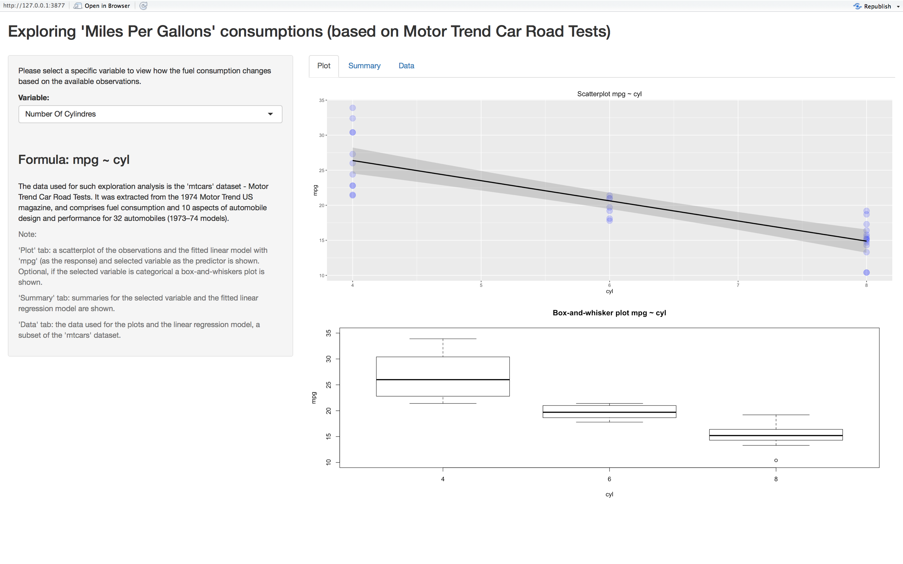
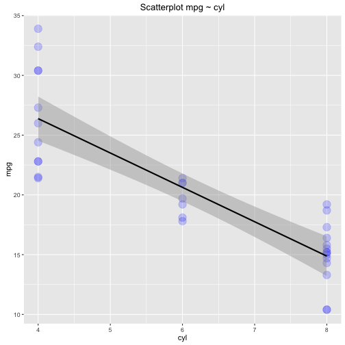

Exploring 'Mile Per Gallon' consumptions App
========================================================
author: Pier Lorenzo Paracchini
date: 24.01.2016
transition: rotate
font-family: "Arial"
width: 1440
height: 900

<small>[Link to assignment Repository in GitHub](https://github.com/pparacch/DevelopingDataProductsAssignment)</small>

Exploratory Analysis Made Easy  
========================================================
A **simple** and **intuitive** application that can be used by **anyone** to **explore** how the **fuel comsumptions** is **affected** by **10 aspects/ features of automobile design and performance** using the `mtcars` dataset.

<small><small>
Assumptions:
- **Response** variable ($Y$): Mile Per Gallon consumption (`mpg`) 
- **Predictor** variable ($X$): any of the other features
- **Simple Regression Model** between the **response** and selected **predictor**
    - $Y = \beta_0 + \beta_1 X + \epsilon$ 
    - where $\epsilon$ is $N(0, \sigma^2)$, and $\epsilon_i$ are iid
</small></small>

UI Overview
========================================================
<small>__SideBar Panel__ allows the user to select the **predictor** she/ he is interested in</small>

<small>__Main Panel__ allows the user to view the information available for the selected **predictor**</small>

<small><small>- __Plot__, shows a scatterplot and, an optional boxPlot, of the available observations **response ~ predictor**</small></small>

<small><small>- __Summary__, shows some basic statistical information about the **predictor** and the fitted **simple regression model**</small></small>

<small><small>- __Data__, shows the raw data used by the application, limited to the **response** and selected **predictor**</small></small>

  

Simple Linear Regression Model Details
========================================================
<small>An example of how the simple regression model is fitted using the `mtcars` dataset. Note the __response__variable is `mpg` while the __predictor__ variable is `cyl`.</small>
<small><small>

```r
library(datasets)
fittedModel <- lm(mpg ~ cyl, data = mtcars)
summary(fittedModel)
```

```

Call:
lm(formula = mpg ~ cyl, data = mtcars)

Residuals:
    Min      1Q  Median      3Q     Max 
-4.9814 -2.1185  0.2217  1.0717  7.5186 

Coefficients:
            Estimate Std. Error t value Pr(>|t|)    
(Intercept)  37.8846     2.0738   18.27  < 2e-16 ***
cyl          -2.8758     0.3224   -8.92 6.11e-10 ***
---
Signif. codes:  0 '***' 0.001 '**' 0.01 '*' 0.05 '.' 0.1 ' ' 1

Residual standard error: 3.206 on 30 degrees of freedom
Multiple R-squared:  0.7262,	Adjusted R-squared:  0.7171 
F-statistic: 79.56 on 1 and 30 DF,  p-value: 6.113e-10
```
</small></small>

Plot Details
========================================================
<small>An example of a scatterplot using the `mtcars` dataset, having `mpg` as __response__ variable and `cyl` as __predictor__ variable. The _black_ line represents the predictions made using the simple regression model fitted using the available observations.</small>

 
